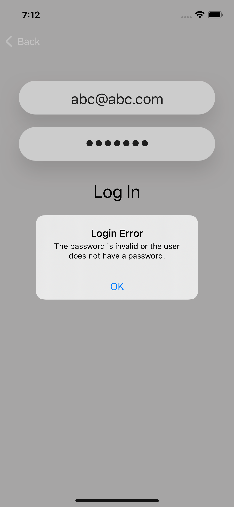

 

## Now Chat
iOS Messaging Application

## Description
User can register with an email address and password chat with one another in a common messaging group. 

## Workflow

## Screenshot
### Welcome Screen

  

### Registration Screen

<table>
  <tr>
    <td>Email and Password needed for Registration</td>
     <td>Error Message on registering with short password</td>
     <td>Error Message on registering with bad email </td>
  </tr>
  <tr>
    <td>  </td>
    <td>  </td>
    <td>   </td>
  </tr>
 </table>

### Login Screen

<table>
  <tr>
    <td>Login Credentials</td>
     <td>Error Message on incorrect login credentials</td>
  </tr>
  <tr>
    <td>   </td>
    <td>   </td>
  </tr>
 </table>
  
## Dummy Login Credentials 
- User 1: abc@abc.com, abcabc
- User 2: xyz@xyz.com, xyzxyz  
  
## Credit 
- SpiderMan Display Picture: <a href="https://www.flaticon.com/free-icons/spiderman" title="Spiderman icons">Spiderman icons created by sketchandbuild - Flaticon</a>
- Wolverine Display Picture: <a href="https://www.flaticon.com/free-icons/superhero" title="superhero icons">Superhero icons created by Stockio - Flaticon</a>

